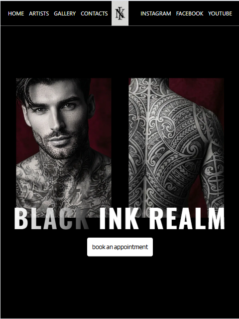

# Tattoo Salon Landing Page 🎨

A modern, adaptive landing page for a tattoo salon. Built with React and Vite to ensure high performance and a better user experience.


<!-- 🔗 Live Demo: https://your-demo-link.vercel.app -->

## 🚀 Tech Stack

-   **React 18** – UI library for building component-based interfaces
-   **Vite** – Next-generation frontend build tool
-   **Tailwind CSS** – Utility-first CSS framework for rapid styling
-   **Git** – Version control system

## ✨ Key Features

-   **Responsive Design:** Fully optimized for mobile, tablet, and desktop devices
-   **Component Architecture:** Modular structure (Header, Footer, Hero) for maintainability
-   **Performance Optimization:** Lazy loading and code splitting for fast initial load

## 🛠 Installation & Setup

### Prerequisites

Make sure you have [Node.js](https://nodejs.org/) (v16 or higher) installed.

### Steps

1.  Clone the repository:
    ```bash
    git clone https://github.com/ZhenkaP/tattoo-salon.git
    ```

2.  Navigate to the project directory:
    ```bash
    cd tattoo-salon
    ```

3.  Install dependencies:
    ```bash
    npm install
    ```

4.  Start the development server:
    ```bash
    npm run dev
    ```

5.  Open your browser at `http://localhost:5173`

## 📦 Production Build

To create an optimized production build:

```bash
npm run build
```

The output will be generated in the `dist/` folder.

## 👩‍💻 Author

**Yevgeniya**
Frontend Developer  
GitHub: [@ZhenkaP](https://github.com/ZhenkaP)

## 📝 License

This project is [MIT](LICENSE) licensed.

---

*This project was created for educational purposes and portfolio demonstration.*